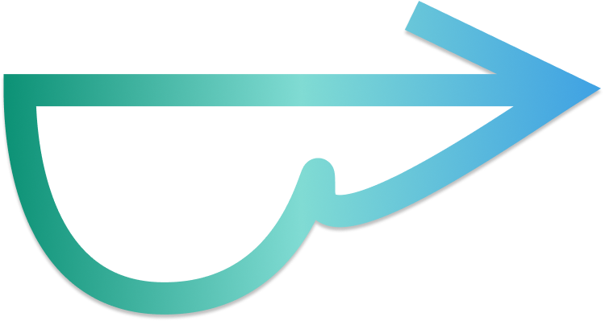

<!-- Improved compatibility of back to top link: See: https://github.com/othneildrew/Best-README-Template/pull/73 -->
<a id="readme-top"></a>
<!--
*** Thanks for checking out the Best-README-Template. If you have a suggestion
*** that would make this better, please fork the repo and create a pull request
*** or simply open an issue with the tag "enhancement".
*** Don't forget to give the project a star!
*** Thanks again! Now go create something AMAZING! :D
-->


<!-- PROJECT SHIELDS -->
<!--
*** I'm using markdown "reference style" links for readability.
*** Reference links are enclosed in brackets [ ] instead of parentheses ( ).
*** See the bottom of this document for the declaration of the reference variables
*** for contributors-url, forks-url, etc. This is an optional, concise syntax you may use.
*** https://www.markdownguide.org/basic-syntax/#reference-style-links
-->


<!-- PROJECT LOGO -->
<br />
<div align="center">
  <a href="https://github.com/ucijakeh2/blind-vision">
    
  </a>

<h3 align="center">Blind Vision</h3>

  <p align="center">
    Empowering independence through smarter navigation and seamless mobility.
  </p>
</div>


<!-- TABLE OF CONTENTS -->
<!-- <details>
  <summary>Table of Contents</summary>
  <ol>
    <li>
      <a href="#about-the-project">About The Project</a>
      <ul>
        <li><a href="#built-with">Built With</a></li>
      </ul>
    </li>
    <li>
      <a href="#getting-started">Getting Started</a>
      <ul>
        <li><a href="#prerequisites">Prerequisites</a></li>
        <li><a href="#installation">Installation</a></li>
      </ul>
    </li>
    <li><a href="#usage">Usage</a></li>
    <li><a href="#roadmap">Roadmap</a></li>
    <li><a href="#contributing">Contributing</a></li>
    <li><a href="#license">License</a></li>
    <li><a href="#contact">Contact</a></li>
    <li><a href="#acknowledgments">Acknowledgments</a></li>
  </ol>
</details> -->


<!-- ABOUT THE PROJECT -->
## About The Project

[![Blind Vision Icon][blind-vision-icon]](https://github.com/ucijakeh2/blind-vision)

<!-- Here's a blank template to get started. To avoid retyping too much info, do a search and replace with your text editor for the following: `github_username`, `repo_name`, `twitter_handle`, `linkedin_username`, `email_client`, `email`, `project_title`, `project_description`, `project_license` -->

A wearable assistive technology designed to improve mobility and environmental awareness for people with vision impairments. This is accomplished through a combination of obstacle detection and map navigation.

There are three major components:
1. Modified glasses which are equipped with ultrasonic sensors that detect the distance to nearby objects.
2. An enhanced blind cane which is integrated with ultrasonic sensors that detect objects which are far below eye-level.
3. A mobile application which processes real-time location of the user and utilizes Google Maps APIs.


<p align="right">(<a href="#readme-top">back to top</a>)</p>


### Built With

* [![React Native][React-Native]][React-Native-url]
* [![TypeScript][Type-Script]][Type-Script-url]
* [![JavaScript][Java-Script]][Java-Script-url]
* [![C++][C-plus-plus]][C-plus-plus-url]

<p align="right">(<a href="#readme-top">back to top</a>)</p>


<!-- GETTING STARTED -->
<!-- ## Getting Started

This is an example of how you may give instructions on setting up your project locally.
To get a local copy up and running follow these simple example steps.

### Prerequisites

This is an example of how to list things you need to use the software and how to install them.
* npm
  ```sh
  npm install npm@latest -g
  ```

### Installation

1. Get a free API Key at [https://example.com](https://example.com)
2. Clone the repo
   ```sh
   git clone https://github.com/github_username/repo_name.git
   ```
3. Install NPM packages
   ```sh
   npm install
   ```
4. Enter your API in `config.js`
   ```js
   const API_KEY = 'ENTER YOUR API';
   ```
5. Change git remote url to avoid accidental pushes to base project
   ```sh
   git remote set-url origin github_username/repo_name
   git remote -v # confirm the changes
   ```

<p align="right">(<a href="#readme-top">back to top</a>)</p> -->


<!-- USAGE EXAMPLES -->
<!-- ## Usage

Use this space to show useful examples of how a project can be used. Additional screenshots, code examples and demos work well in this space. You may also link to more resources.

_For more examples, please refer to the [Documentation](https://example.com)_

<p align="right">(<a href="#readme-top">back to top</a>)</p> -->

<!-- Product Illustrations -->
## Product Illustrations

* [Hardware](https://github.com/ucijakeh2/blind-vision/blob/main/hardware/README.md)
* [Firmware](https://github.com/ucijakeh2/blind-vision/blob/main/firmware/README.md)
* [Software](https://github.com/ucijakeh2/blind-vision/blob/main/software/README.md)
 
<p align="right">(<a href="#readme-top">back to top</a>)</p>


<!-- Product Demonstration -->
## Product Demonstration

Here is a video demonstrating how our products work: [Blind Vision Demonstration](https://drive.google.com/file/d/1cYQlzCVtrWo57RDogcXgDTrOfJF4kutX/view)

<p align="right">(<a href="#readme-top">back to top</a>)</p>


<!-- ACCOMPLISHMENTS -->
## Accomplishments

* Hardware:
  - [x] Glasses: Equipped with sensors, speakers, compass, and ESP32.
  - [x] Blind Stick: Integrated with sensors, actuators, and ESP32.
        
* Firmware:
  - [x] Reads distance from ultrasonic sensors, direction from a digital compass, and controls speakers/actuators.
        
* Software:
  - [x] An Android app that connects to and controls glasses and blind stick via BLE, providing directions using Google Maps API.

<p align="right">(<a href="#readme-top">back to top</a>)</p>


<!-- POTENTIAL IMPROVEMENTS -->
## Potential Improvements

Here are a couple of things we plan to do to improve our products if we have more time and a higher budget:

* Hardware:
  - [ ] Glasses: Include a digital potentiometer to control speakers' volume.
  - [ ] Blind Stick: Use a LiDAR sensor instead of an ultrasonic sensor for better range.
  - [ ] Debug BLE interference with ultrasonic sensors.
        
* Firmware:
  - [ ] Enable BLE connection at all times.
        
* Software:
  - [ ] Build a back-end server with a database.
  - [ ] Integrate secure authentication methods.

<p align="right">(<a href="#readme-top">back to top</a>)</p>


<!-- LICENSE -->
<!-- ## License

Distributed under the project_license. See `LICENSE.txt` for more information.

<p align="right">(<a href="#readme-top">back to top</a>)</p> -->


<!-- CONTACT -->
## Contact

* Hardware:
  * Ethan Reynaga: ehreynag@proton.me
    
* Firmware:
  * Jake Harrison: jakeharrison505@gmail.com
    
    * [![LinkedIn][Linked-In]](https://www.linkedin.com/in/jake-harrison-0709b1218)
    * [![GitHub][Git-Hub]](https://github.com/ucijakeh2)
  
* Software:
  * Thanh Huy Tu: tuthanhhuy2004@gmail.com
    * [![LinkedIn][Linked-In]](https://www.linkedin.com/in/thanhhuytu)
    * [![GitHub][Git-Hub]](https://github.com/TuThanhHuy2124)
      
  * Junchi Zhang: junchiz4@uci.edu

Project Link: [https://github.com/ucijakeh2/blind-vision](https://github.com/ucijakeh2/blind-vision)

<p align="right">(<a href="#readme-top">back to top</a>)</p>


<!-- MARKDOWN LINKS & IMAGES -->
<!-- https://www.markdownguide.org/basic-syntax/#reference-style-links -->
[blind-vision-icon]: images/icon.png
[React-Native]: https://img.shields.io/badge/React%20Native-20232A?style=for-the-badge&logo=react&logoColor=61DAFB
[React-Native-url]: https://reactnative.dev/
[Type-Script]: https://img.shields.io/badge/TypeScript-3178C6?style=for-the-badge&logo=typescript&logoColor=fff
[Type-Script-url]: https://www.typescriptlang.org/
[Java-Script]: https://img.shields.io/badge/JavaScript-F7DF1E?style=for-the-badge&logo=javascript&logoColor=000
[Java-Script-url]: https://www.javascript.com/
[C-plus-plus]: https://img.shields.io/badge/C++-%2300599C.svg?style=for-the-badge&logo=c%2B%2B&logoColor=white
[C-plus-plus-url]: https://cplusplus.com/
[Linked-In]: https://custom-icon-badges.demolab.com/badge/LinkedIn-0A66C2?style=for-the-badge&logo=linkedin-white&logoColor=fff
[Git-Hub]: https://img.shields.io/badge/GitHub-%23121011.svg?style=for-the-badge&logo=github&logoColor=white
