# Hardware Gallery
Below are notable photos from the hardware development process

## Finished Products

   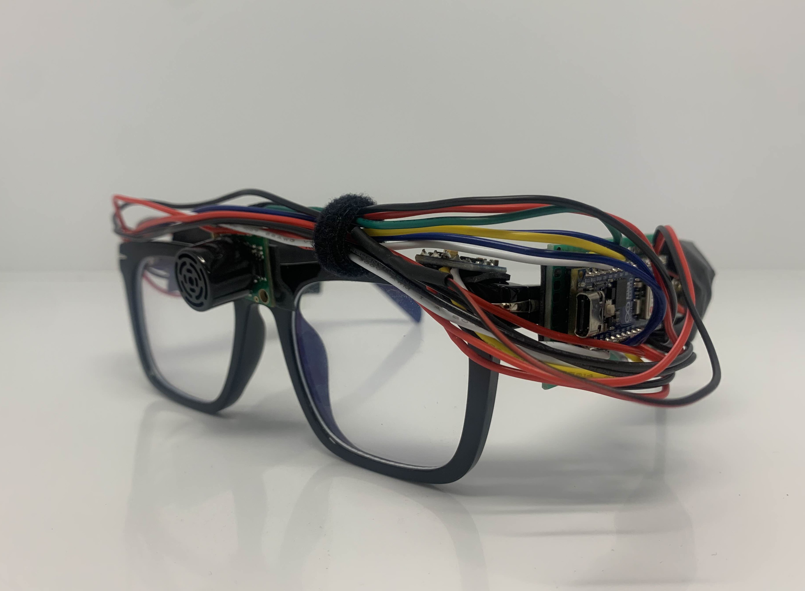
   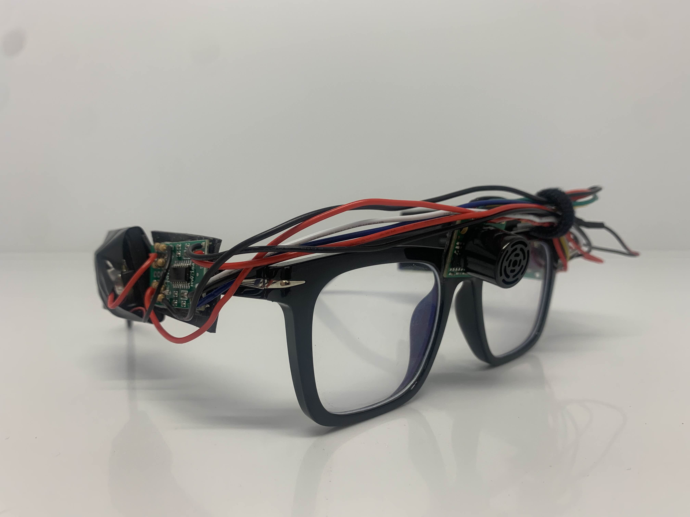
    
   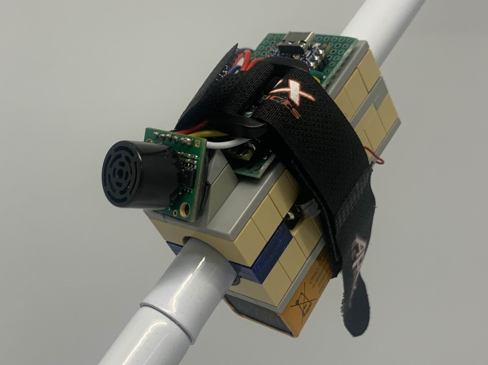
   

Begin Development
 

## Begin Development

### Components

#### Ultrasonic Sensor & Vibrating Actuators 

   

#### Compass

   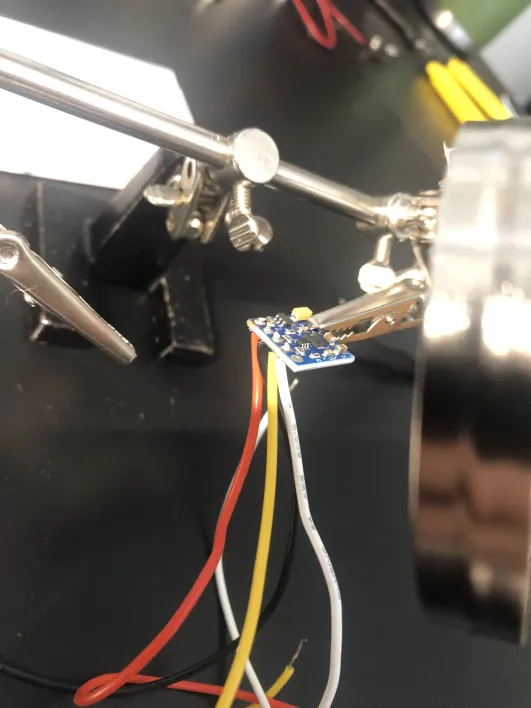

#### Speaker

   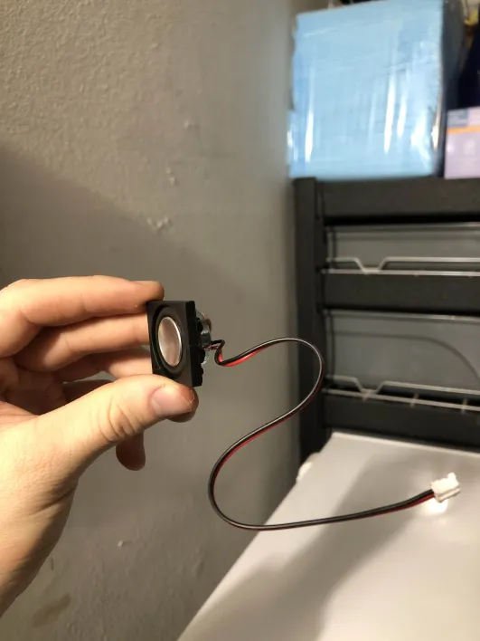
   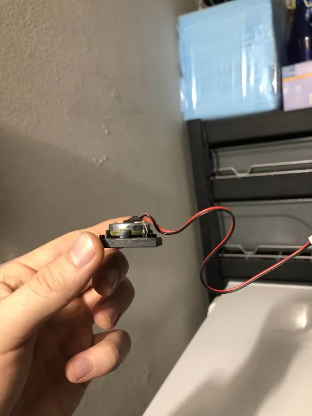

#### Casing

   
   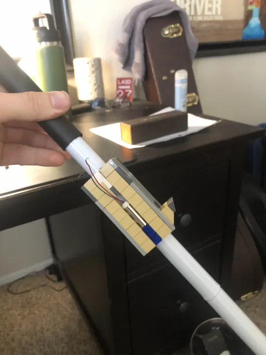

#### ESP32 Nano

   

### Wiring

   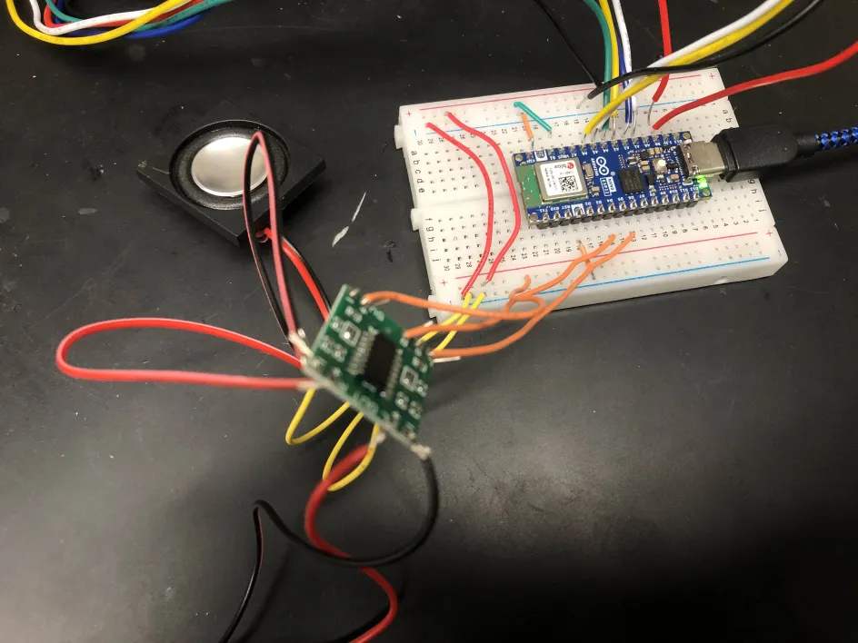 
    
   

Early Stage
 
   
## Early Stage

   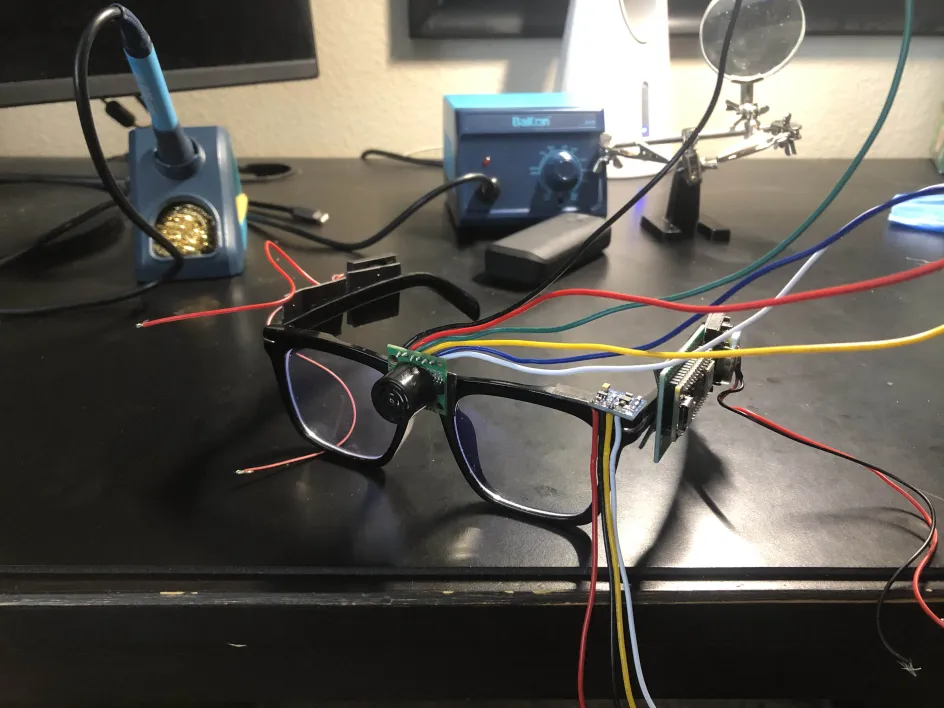
   
    
   
   

Middle Stage
 

## Middle Stage

   
   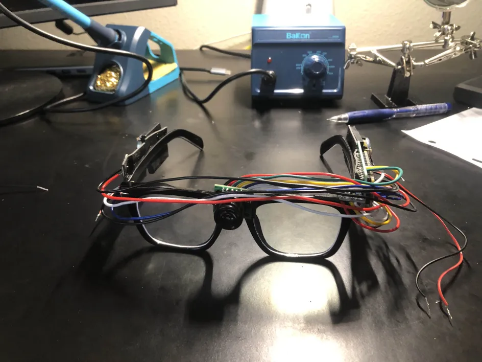
   
    
   

Late Stage
 
   
## Late Stage

   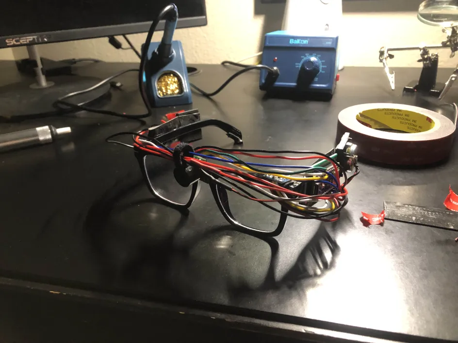
   
    
   
   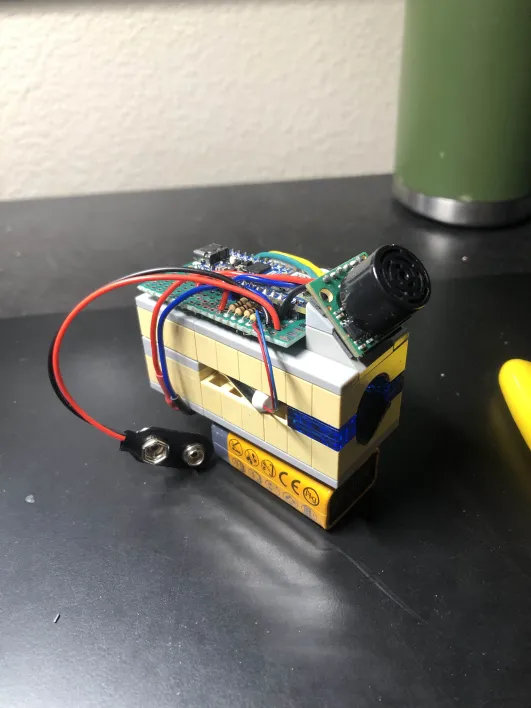

Schematics
 
   
## Schematics

   
   
    
   
   

