# Software Gallery
* Figma: [Blind Vision UI Design](https://www.figma.com/proto/bcqtnWh1L766dvBaiZgoI0/Blind-Vision)
* Below are some screenshots from the Android app

## Welcome Screen

   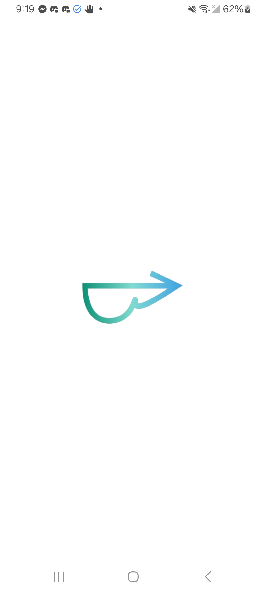
   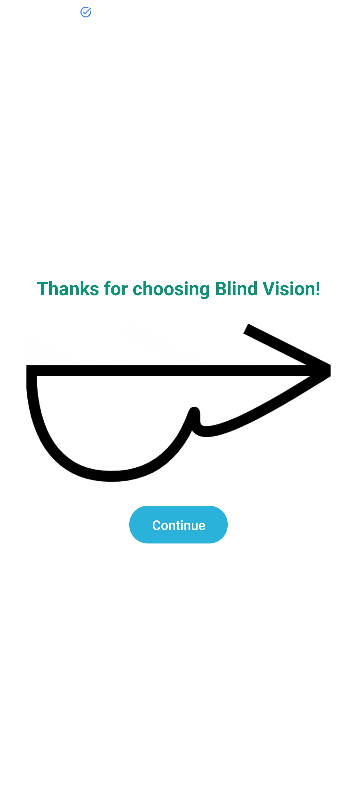

## Authentication

   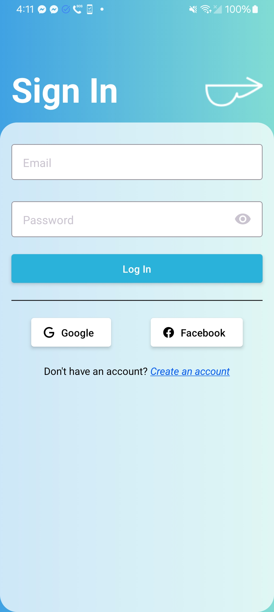
   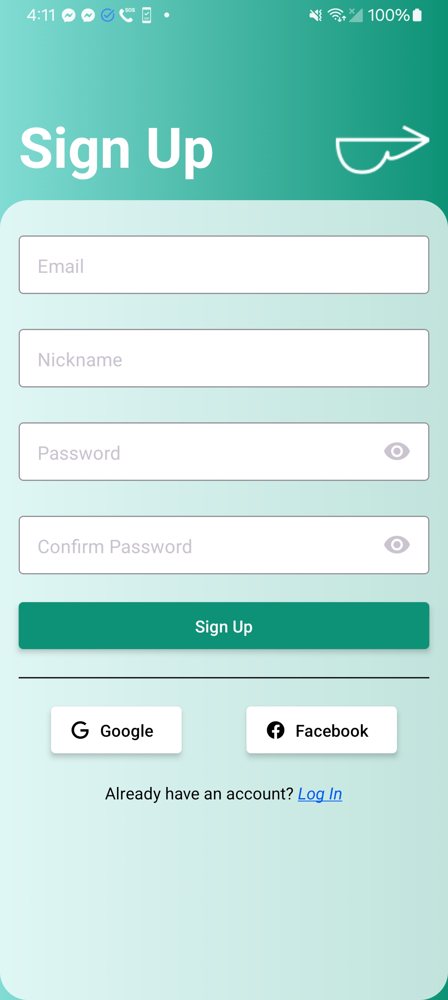

## BLE Connection

   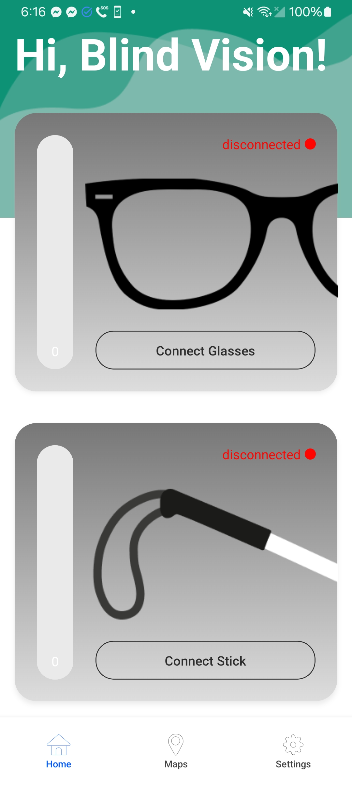
   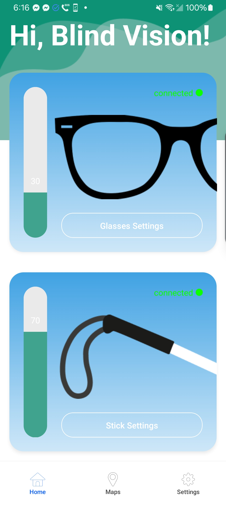

## Settings

   
   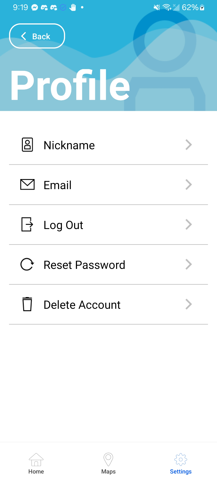
    
   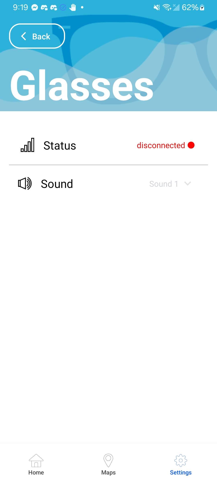
   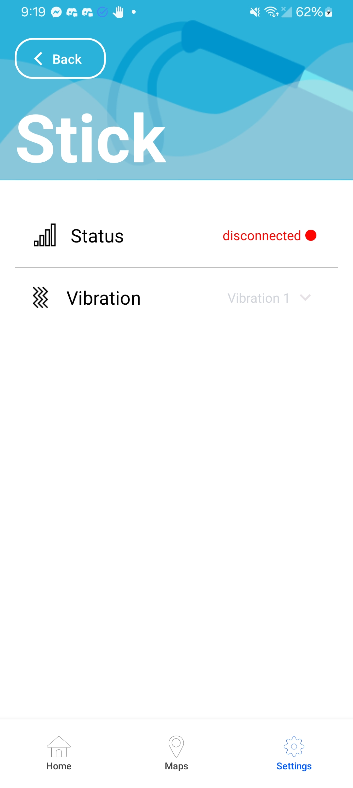

## Dark Mode

   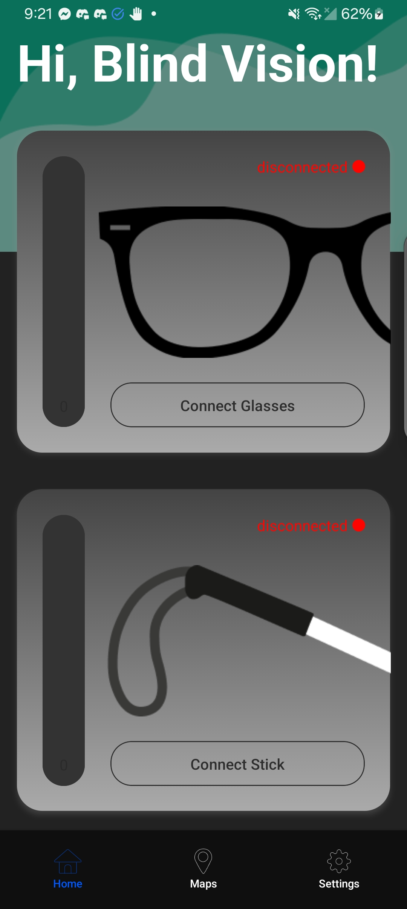
   
   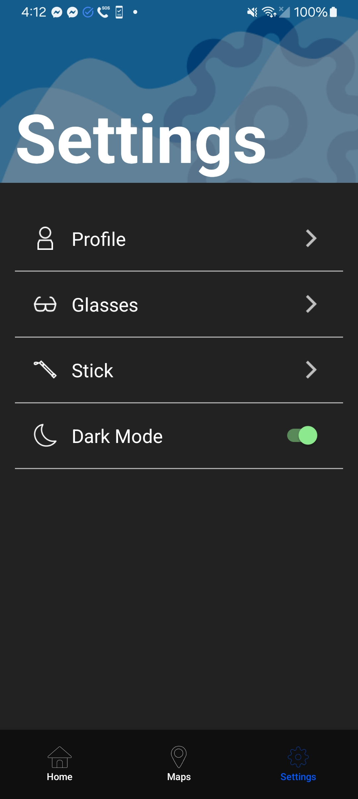
   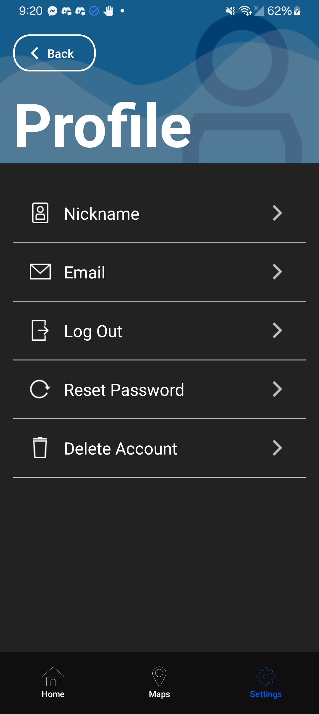
   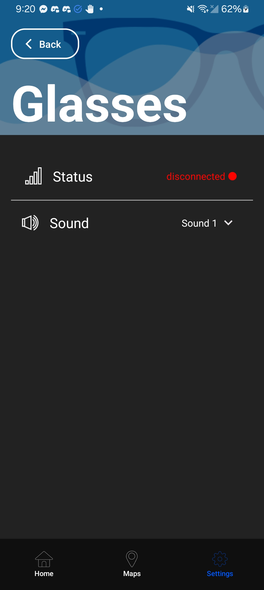
   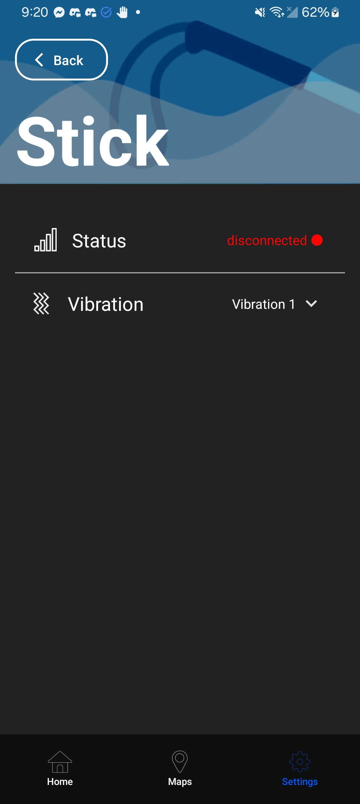

